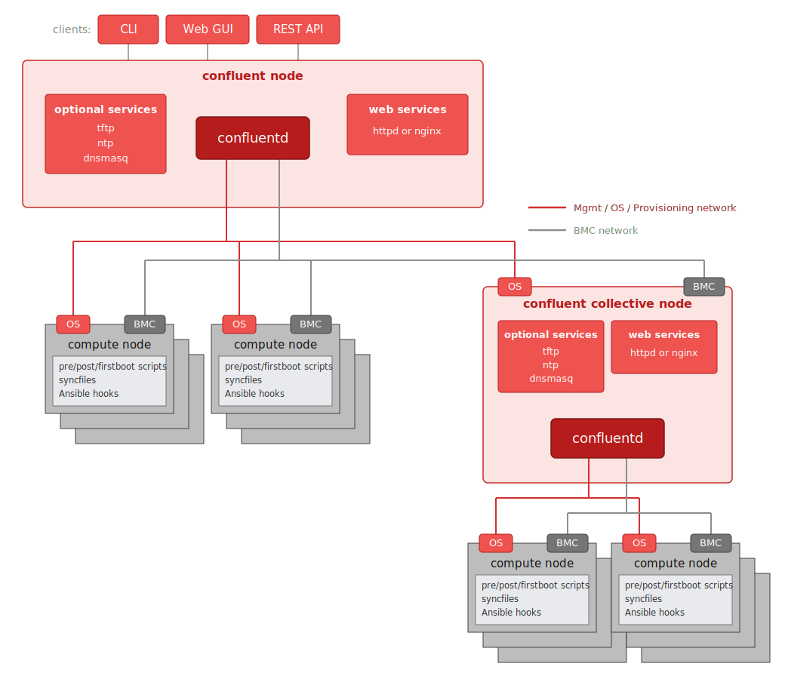

Confluent is built on a client-server architecture: management nodes run the `confluentd` service,
acting as the central control point. Clients interact with the service through the command-line
tools, the web UI, and the REST API, so administrators can manage clusters using their preferred
interface.

The confluent service can be deployed as a standalone server in environments where high availability
is not a priority. For larger or mission-critical deployments, multiple confluent instances can be
configured to provide both scalability and fault tolerance.

The diagram below illustrates the architectural design of confluent:

A confluent deployment consists of four fundamental components:

1. Confluent node
2. Confluent collective node(s)
3. Compute nodes
4. Networks

## Confluent node

In any confluent deployment - whether standalone or in collective mode - there must be one initial
server designated as the confluent node, which is the first to run the `confluentd` service. This
node serves as the foundation of the management infrastructure and can be either a physical or
virtual server where the confluent software is installed. Once operational, it orchestrates the
provisioning and configuration of the entire cluster.

The confluent node stores and maintains a database that includes information about all managed
nodes, groups, OS deployment profiles, and their associated [attributes](../user_reference/node_attributes.md).
To support operating system installation and other provisioning tasks it also runs a web server
(httpd or nginx), and can be complemented by optional network services:

* `tftpd` for [PXE booting clients](../advanced_topics/confluentosdeploy.md#preparing-for-tftp-optional) (not needed with pure HTTP boot)
* `chronyd`/`ntpd` for time synchronization of the cluster
* `dnsmasq` for DNS and/or [DHCP](confluentdhcp.md) - confluent can generate its configuration
  from the node attribute database with [`confluent2dnsmasq`](../manuals/confluent2dnsmasq.md),
  and maintain `/etc/hosts` entries with [`confluent2hosts`](../manuals/confluent2hosts.md)

## Confluent collective node(s)

A multi-instance setup is managed through [collective mode](../advanced_topics/collective.md), which
enables multiple confluent servers to work together as peers, providing a scalable, resilient, and
highly available management infrastructure for large clusters.

Traditionally, very large clusters have a head node and one or more service nodes. The service
nodes are subordinate to the head node and help offload tasks to reduce CPU and network load. A
major drawback of that architecture is that if the head node fails, the service nodes typically
become non-functional as well.

Confluent takes a different approach: in a collective deployment, all members are treated as equals -
there is no strict hierarchy between "head" and "service" nodes. Administrators can still organize
deployments hierarchically for practical reasons, designating one node as the primary system and
others as collective members responsible for subsets of the infrastructure based on network topology
or workload distribution. See [confluent collective architecture](collective_arch.md) for the
design details and example topologies.

A collective node is installed and configured like a standalone confluent node. Its primary role is
to share the management workload, reducing pressure on any single node. Beyond load balancing, the
collective also provides high availability and failover: if one member becomes unavailable, the
remaining members continue to operate.

## Compute nodes

In a confluent-managed cluster, compute nodes are fully orchestrated by confluent - from initial
[hardware discovery](../user_reference/confluentdiscovery.md) and configuration to bare-metal
[OS installation](../user_reference/osdeploy.md) and ongoing lifecycle management. Deployment
behavior can be customized per profile with pre/post/firstboot scripts, synchronized files, and
Ansible playbooks.

The term "compute node" is used generically within confluent to refer to any node managed by the
system. This includes a wide variety of logical server roles such as CPU nodes, GPU nodes, login
nodes, storage nodes, and more. Regardless of their specific function, all of these nodes are
provisioned and maintained through the same unified confluent framework.

## Networks

In general, there are at least two networks in a large cluster environment: the BMC network and the
management/provisioning network.

### BMC network

Every managed server contains a baseboard management controller (BMC) - on Lenovo ThinkSystem
servers this is the XClarity Controller (XCC), the integrated service processor consolidating system
monitoring, video control, and remote presence.

The BMC network is used by confluent to control nodes out-of-band via the service processor. In
some configurations the BMC is set to "shared mode", using the same physical interface as the
management and provisioning network, so out-of-band and in-band traffic share a single physical
connection. This simplifies cabling and reduces additional hardware requirements.

### Management and provisioning network

The management and provisioning network is used by confluent to install operating systems and to
manage compute nodes in-band - modifying OS settings, copying files, installing additional
packages, and applying security configurations. Both the confluent node and the in-band network
interfaces of the compute nodes are connected to this network. In large cluster environments,
collective nodes can be configured to distribute the workload, reducing the load on a single
confluent node and enhancing scalability and reliability.
