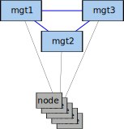
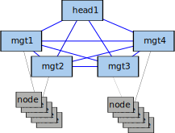

This document will describe the design of the confluent collective implementation.

# Collective contrasted with 'Hierarchical' mode

In xCAT, the design point was generally is 'head' system and some number of 'service nodes'. If desiring HA in the 'head' role, it was up
to the user to provide an active-backup HA solution.  If the 'head' system is gone, this generally meant the 'service nodes' would no longer
function (as the head node is conventionally also the shared database user).

In confluent, as far as confluent itself is concerned, all members are equivalent and no member is considered 'head' versus 'service'. However,
it may still be deployed in a hierarchical manner where conventionally certain nodes are considered the 'head' system by administrators
and 'service nodes' are collective members that reside on the appropriate networks to manage/deploy a subset of systems.  The main apparent difference
will be that service nodes no longer care about the 'head' nodes going offline compared to a similar xCAT configuration.

# Example topologies

As confluent does not have restrictions around the role of collective members, there is flexibility in how you may approach a
collective.

The collective may be flat, with all nodes equally bound to any collective member:  
  
&nbsp;
&nbsp;

It may be hierarchical with a node designated a head node by convention and delegating nodes to specific collective members:  
  
&nbsp;
&nbsp;

It my be hierachical with pools of collective managers available to each segment:  
  
&nbsp;
&nbsp;

Or it may be a headless segmented collective, where the 'head' role is omitted:  
  
&nbsp;
&nbsp;

Any other number of mix and match of the above strategies may be used in a collective.

# Intra-collective trust

The invite token generated as part of the invite/join procedure is used as a shared secret to mutually attest to the in-use certificates
for a join, and the persistent trust is managed through mutual TLS authentication. Every communication within a collective is protected
by the certificates that were in-use at the time of issuing the join with the correct token.  Note that while the collective member
that issued the invitation is validating the client, the client is also using the invitation to authenticate the collective member, assuring
both parties that both certificates are valid with no intermediaries.

# Replicated data

The node attribute database is inherently replicated internally by confluent by collective members. This contrasts to xCAT in
that no external database is required, and replication of the database is handled implicitly by joining the collective.  At every
point, every active collective member has a full copy of the node attribute database and persists it locally to /etc/confluent/cfg. When
a collective member goes offline and later reconnects, the full node attribute database is replicated to the reconnecting member.

# Quorum

Confluent collective is driven by a straightforward quorum scheme: if half or more collective members are unreachable, the collective
locks down functionality. At this time this includes all collective members with no mechanism to indicate consideration of only a subset.

# Shared storage consideration

While the node attribute database is replicated automatically among collective members, the /var/lib/confluent storage used by OS deployment must be
synchronized or shared at the user's discretion.  There is no particular requirement placed on the mechanism beyond that it be consistent when used
by the collective members, so a number of storage synchronization or remote/clustered filesystem approaches are acceptable. In contrast to xCAT, where /install
was expected to be partially consistent, partially unique to the service node, confluent expects the entirety of the directory to be consistent.

# Request routing

A request/command may be issued to any member of the collective and will be internally distributed as appropriate among collective members according
to nodes' respective collective.manager.

# Failover of collective manager

When a collective member goes offline, nodes currently managed as indicated by `collective.manager` can be automatically reassigned by setting `collective.managercandidates`.

# Restricting OS deployment to select collective members

In addition to indicating candidates for automatic failover, collective.managercandidates also indicates collective members that are allowed to offer deployment services to
the respective node.

# Considerations for local services like DHCP/tftp

In xCAT, the head/service nodes required specific DHCP configuration and usually service node specific boot configuration files.  In confluent, there are no such
requirements.  The DHCP activity may be delegated or static assignments are given from the confluent server direct from the replicated node attribute database.
The deployment profiles no longer require the deployment server be indicated on the kernel command line, and code in the linux environments handle that, again
directly interacting with confluent service and by extension the node attribute database.  There are no longer node-specific nor deployer-specific command line
arguments.
