# Proxmox Guide with Confluent

## Installing proxmox

Proxmox may be installed manually or by using confluent.  You do not have to use confluent to install proxmox to use proxmox as a virtual machine platform.

Manual installation is well covered by Proxmox documentation, so this guide will touch on the confluent deployment of the proxmox host. [Skip to the next section](#using-proxmox-virtual-machines-as-nodes) if you already have proxmox deployed or want to deploy it manually or by other means.

For proxmox, start by creating a debian profile for confluent.  Grab the `mini.iso` for debian; for trixie, it is currently at
[this url](https://deb.debian.org/debian/dists/trixie/main/installer-amd64/current/images/netboot/mini.iso)

With this downloaded, import it using osdeploy:

    # osdeploy import mini.iso 
    Importing from /tmp/debian/mini.iso to /var/lib/confluent/distributions/debian-13.4-x86_64
    complete: 100.00%    
    Deployment profile created: debian-13.4-x86_64-default

It is suggested to make a copy of the profile to customize for proxmox:

    # cd /var/lib/confluent/public/os/
    # cp -a debian-13.4-x86_64-default/ debian-13.4-x86_64-proxmox

Enable the provided example proxmox scripts:

    # cd /var/lib/confluent/public/os/debian-13.4-x86_64-proxmox/
    # cp scripts/proxmox/proxmoxve.firstboot scripts/firstboot.d/
    # cp scripts/proxmox/proxmoxve.post scripts/post.d/

Now the profile is ready to be deployed, just like any other profile:

    # nodedeploy pmx8 -n debian-13.4-x86_64-proxmox 
    pmx8: network
    pmx8: on

Note that proxmox may lengthen the post and firstboot phases a bit, wait until you see:

    # nodedeploy pmx8
    pmx8: completed: debian-13.4-x86_64-proxmox

## Using proxmox virtual machines as nodes

The first step is to create virtual machine(s) on the Proxmox host.  Currently, confluent does not have facilities for this, just create them as usual.  It is suggested to enable TPM2, particularly for diskless images.

### Setting up networking using the proxmox WebUI

By default, you access the proxmox WebUI on port 8006.  If deployed by confluent, you may use the root user with the root password specified for the node to log into the WebUI.

In order to use VMs as nodes, you will probably want to change the networking to a bridge configuration.

First, you will want to clear the configuration from the current nic that you want to turn into a bridge.  Don't worry, changes will not apply even when you click 'OK'.  This is needed to make the network addresses available to the bridge.

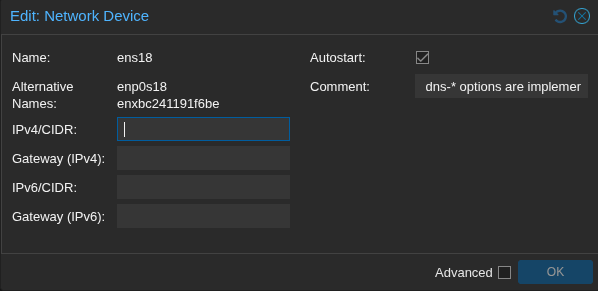

You will want to select to create a new bridge

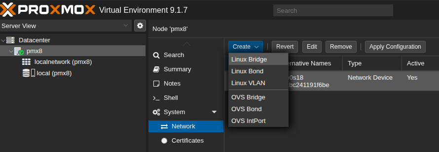

Finally, apply the network configuration and make sure to include the port name in the configuration.

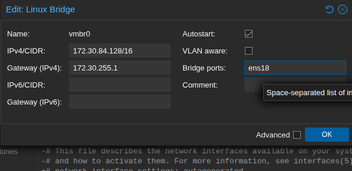

When finished, click `Apply Configuration` to continue.

### Using the Proxmox WebUI to create a virtual machine

If you want to use the WebUI, here's an example of creating a VM:

Select `Create VM` from the right click menu on the host.  For name, have the VM name match the node name you will want in confluent.

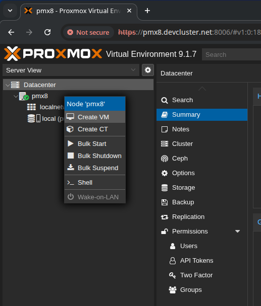

Do not use any media; we will be using confluent for the OS deployment instead.

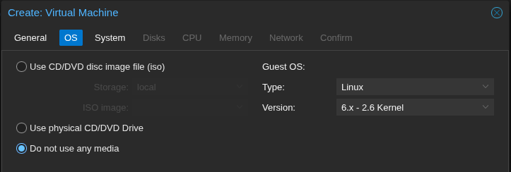

For system, you will likely want to add a TPM and select storage for the TPM. This allows better diskless boot behaviors in the VM.

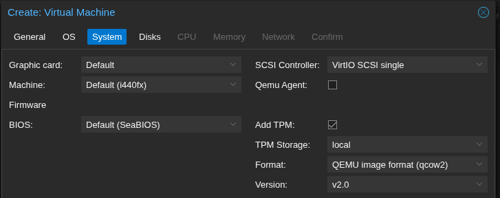

You can select disk size as appropriate.  Here we selected write-back cache for better performance.

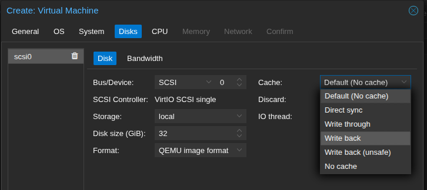

For CPU, you will likely want to change to `host`, as the default is incompatible with some newer distributions.

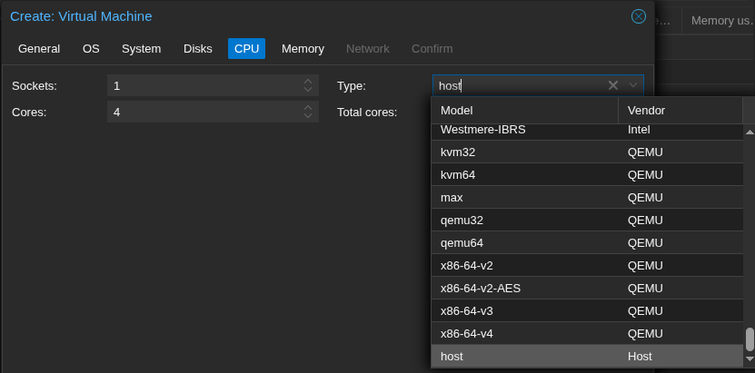

You will likely want more memory than the default. OS installers run from ramfs and some can require a few gigabytes.

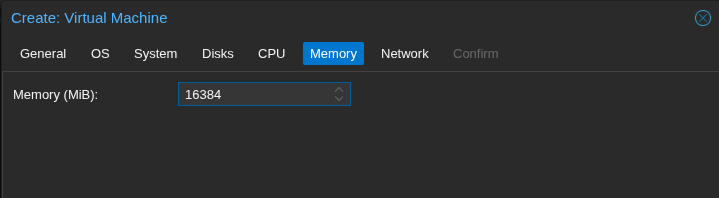

Here we select the bridge we created before.

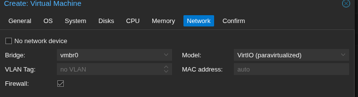

Review settings and click 'Finish' to create the VM

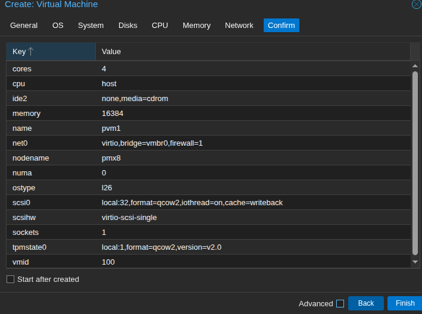

### Using CLI to create a virtual machine

The following is an example using the CLI to create a VM instead of the WebUI (with TPM2, 96GB disk, 8 cores, 16GB of RAM):

    # qm create 101 --name pvm2 --ostype l26 --scsihw virtio-scsi-single --tpmstate0 local:1,version=v2.0 -scsi0 local:96,format=qcow2,iothread=on,cache=writeback --sockets 1 --cores 8 --numa 0 --cpu host --memory 16384 --net0 virtio,bridge=vmbr0,firewall=1
    Formatting '/var/lib/vz/images/101/vm-101-disk-0.qcow2', fmt=qcow2 cluster_size=65536 extended_l2=off   preallocation=metadata compression_type=zlib size=103079215104 lazy_refcounts=off refcount_bits=16
    scsi0: successfully created disk 'local:101/vm-101-disk-0.qcow2,cache=writeback,iothread=1,size=96G'
    Formatting '/var/lib/vz/images/101/vm-101-disk-1.raw', fmt=raw size=4194304 preallocation=off
    tpmstate0: successfully created disk 'local:101/vm-101-disk-1.raw,size=4M,version=v2.0'

## Configuring confluent for using the proxmox VMs as nodes

First, if it doesn't already exist as a confluent node, define a node using the name of the proxmox host:

    # nodedefine pmx8
    pmx8: created

Create a node as you normally would.  A terse example assuming existing general group settings and focusing solely on the proxmox facet:

    # nodedefine pvm1 hardwaremanagement.method=proxmox bmcuser=root@pam hardwaremanagement.manager=pmx8
    pvm1: created
    # nodeattrib pvm1 -p bmcpass
    Enter value for bmcpass: 
    Confirm value for bmcpass: 
    pvm1: secret.hardwaremanagementpassword: ********

Here's an alternative including other node setup attributes explicitly rather than inheriting from `everything` as above:

    # nodedefine pvm2 hardwaremanagement.method=proxmox bmcuser=root@pam hardwaremanagement.manager=pmx8 net.ipv4_address=172.30.84.{id.index%255} deployment.useinsecureprotocols=firmware dns.domain=devcluster.net dns.servers=172.30.193.20
    pvm2: created
    # nodeattrib pvm2 -p crypted.rootpassword bmcpass
    Enter value for crypted.rootpassword: 
    Confirm value for crypted.rootpassword: 
    Enter value for bmcpass: 
    Confirm value for bmcpass: 
    pvm2: ********
    pvm2: crypted.rootpassword: ********
    pvm2: secret.hardwaremanagementpassword: ********

To push the ipv4 addresses from net attributes to /etc/hosts:

    # confluent2hosts -a pvm1,pvm2
    # getent hosts pvm2
    172.30.84.130   pvm2 pvm2.devcluster.net

Next, have confluent gather needed information about the virtual machines, similar to a manually added BMC-managed node:

    # nodeinventory pvm[1,2] -s

The node is now ready for use as a normal node, for example, to boot a diskless profile I have built:

    # nodedeploy pvm[1,2] -n alma-9.7-x86_64-diskless

    pvm2: network
    pvm1: network
    pvm2: on
    pvm1: on
    # sleep 30 # Just some time to let the VMs boot
    # nodeshell pvm[1,2] hostname
    pvm1: pvm1
    pvm2: pvm2

## Confluent commands to work with Proxmox VMs

If you add a serial port to the VM, then you can use console.method=proxmox to have a SOL console in nodeconsole.  Other than that, the graphics console in proxmox VMs is supported in the confluent webui as well as nodeconsole:

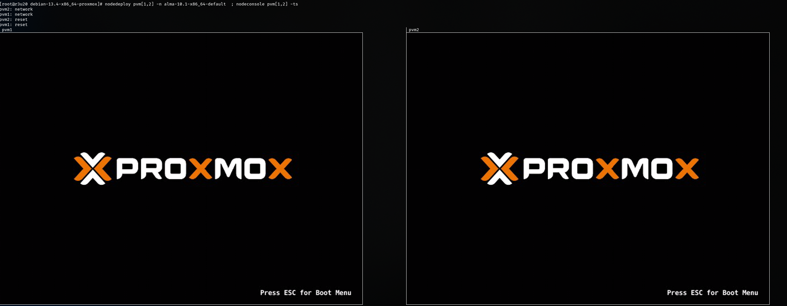

Nodeinventory also works:

    # nodeinventory pvm[1,2]
    pvm2: System Product name: Proxmox qemu virtual machine
    pvm2: System Manufacturer: qemu
    pvm2: System UUID: f7d1eab8-bb7b-4fc2-9dcb-5781e5a02c8b
    pvm2: Network adapter net0 Type: Ethernet
    pvm2: Network adapter net0 Model: virtio
    pvm2: Network adapter net0 MAC Address 1: BC:24:11:25:82:89
    pvm1: System Product name: Proxmox qemu virtual machine
    pvm1: System Manufacturer: qemu
    pvm1: System UUID: 20a9bd43-ff2e-4216-8c00-ce6c9e05d560
    pvm1: Network adapter net0 Type: Ethernet
    pvm1: Network adapter net0 Model: virtio
    pvm1: Network adapter net0 MAC Address 1: BC:24:11:FF:33:88

As well as nodepower, nodesetboot, and by extension nodeboot. Other confluent commands are not supported at this time.
