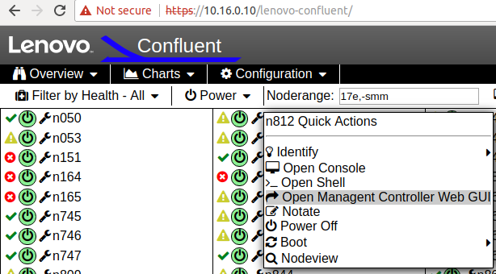
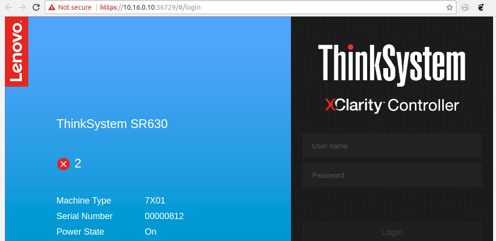
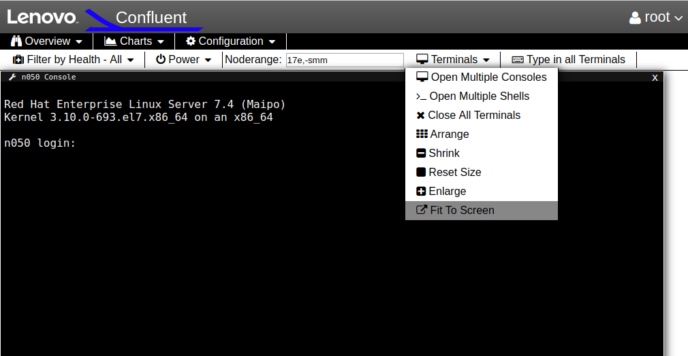
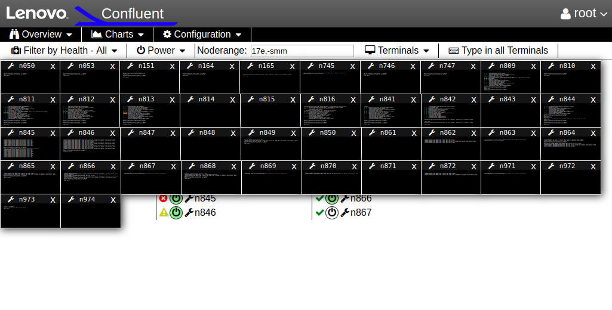
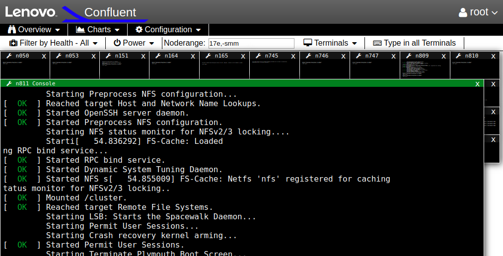
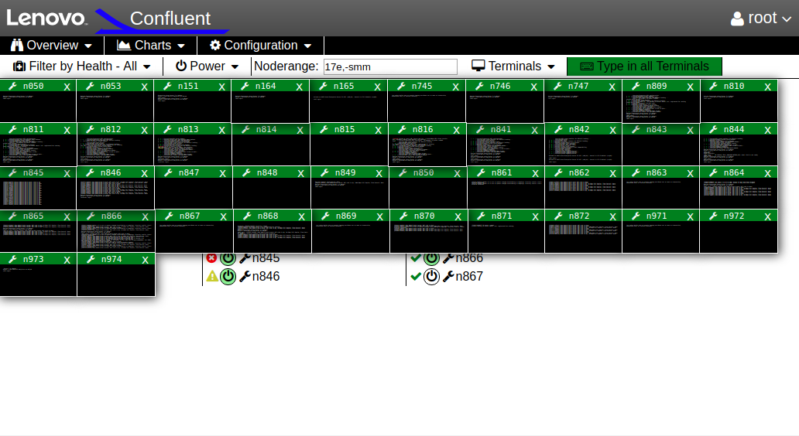

# Recent Confluent Features

Confluent has a new discovery mechanism.  This allows for zero-power xCAT style discovery and configuration of lenovo systems.
<!-- more -->

New to 1.7.2 is the `nodediscover` command:
```
mn10:~ # nodediscover list
           Node|          Model|         Serial|                                UUID|      Mac Address|        Type|                            Current IP Addresses
---------------|---------------|---------------|------------------------------------|-----------------|------------|------------------------------------------------
               |               |               |                                    |08:94:ef:3b:de:d4|  lenovo-smm|               fe80::a94:efff:fe3b:ded4%eth0.103
           n972|     7X12ABC1WW|       00000972|5d09c001-0015-11e7-ac42-f0b2116de94f|08:94:ef:40:77:91|  lenovo-xcc|                                    10.19.67.204
           n974|     7X12ABC1WW|       00000974|839ab980-ff3d-11e6-9998-c3776b1f3327|08:94:ef:40:78:81|  lenovo-xcc|                                    10.19.67.206
           n973|     7X12ABC1WW|       00000973|5b767e21-0224-11e7-b141-e0d42e02a772|08:94:ef:40:79:35|  lenovo-xcc|                                    10.19.67.205
               |     7X12ABC1WW|       00000971|aee7ccee-00cd-11e7-ab9a-f6503ce8c5f9|08:94:ef:40:79:91|  lenovo-xcc|                                    10.19.67.203
           n881|     7X2106Z000|       00000881|4f2b8ff7-0329-11e7-8af9-e9166c58475d|08:94:ef:40:86:a8|  lenovo-xcc|                                    10.19.67.113
           n875|     7X2106Z000|       00000875|d0c8c6d8-0260-11e7-9f49-c74a3f22502e|08:94:ef:40:86:b9|  lenovo-xcc|                                    10.19.67.107
           n879|     7X2106Z000|       00000879|418420a7-0264-11e7-9abe-9abc80ea0f53|08:94:ef:40:86:dd|  lenovo-xcc|                                    10.19.67.111
           n878|     7X2104Z000|       00000878|6ac9fdd8-0277-11e7-a5d0-f6d9cd5bccb1|08:94:ef:40:87:11|  lenovo-xcc|                                    10.19.67.110
           n887|     7X2104Z000|       00000872|9746b41f-114d-11e7-b026-efba1952ac2a|08:94:ef:40:87:2d|  lenovo-xcc|  10.19.67.104,fe80::a94:efff:fe40:872d%eth0.103
           n880|     7X2106Z000|       00000880|aa512271-02d5-11e7-87cb-f0f5d95c9267|08:94:ef:40:88:50|  lenovo-xcc|                                    10.20.67.112
           n873|     7X2104Z000|       00000873|63b2ab2c-031e-11e7-aefe-d8531125e361|08:94:ef:40:88:89|  lenovo-xcc|  10.19.67.105,fe80::a94:efff:fe40:8889%eth0.103
          n1050|     7X2106Z000|       DG17000A|89c6f82e-032b-11e7-ac1f-8377fd1aa62c|08:94:ef:40:89:09|  lenovo-xcc|               fe80::a94:efff:fe40:8909%eth0.103
           n882|     7X2104Z000|       00000882|6b09d40e-0304-11e7-af7e-f3663703a759|08:94:ef:40:89:5d|  lenovo-xcc|                                    10.19.67.114
           n876|     7X2104Z000|       00000876|828a0a32-0358-11e7-a2c7-c0c2c8ac60e5|08:94:ef:40:89:e9|  lenovo-xcc|                                    10.19.67.108
          n1051|     7X2106Z000|       DG17000B|9ec10203-0261-11e7-aad9-9c80ee2c78c9|08:94:ef:40:8a:39|  lenovo-xcc|               fe80::a94:efff:fe40:8a39%eth0.103
           n874|     7X2106Z000|       00000874|d43a6361-033e-11e7-8d7b-d8e30aa8bc5a|08:94:ef:40:8a:49|  lenovo-xcc|                                    10.19.67.106
```

The nodediscover command can also perform manual discovery, including import from .csv to assign IP addresses:

```
Usage: nodediscover [list|assign|rescan] [options]

Options:
  -h, --help            show this help message and exit
  -m MODEL, --model=MODEL
                        Operate with nodes matching the specified model number
  -s SERIAL, --serial=SERIAL
                        Operate against the system matching the specified
                        serial number
  -u UUID, --uuid=UUID  Operate against the system matching the specified UUID
  -n NODE, --node=NODE  Operate with the given nodename
  -e MAC, --ethaddr=MAC
                        Operate against the system with the specified MAC
                        address
  -t TYPE, --type=TYPE  Operate against the system of the specified type
  -c, --csv             Use CSV formatted output
  -i IMPORT.CSV, --import=IMPORT.CSV
                        Import bulk assignment data from given CSV file
```


It is now possible to explore the full mac address and LLDP data of ethernet switches, whether they are related to nodes or not::

```
/ -> show /networking/macs/by-mac/7c-d3-0a-ce-39-0d
mac: 7c:d3:0a:ce:39:0d
possiblenode=""
ports=[
 {
  "switch": "172.16.2.6", 
  "macsonport": 374, 
  "port": "Port-Channel65"
 }, 
 {
  "switch": "172.16.2.51", 
  "macsonport": 367, 
  "port": "Port-Channel53"
 }, 
 {
  "switch": "172.16.2.10", 
  "macsonport": 1, 
  "port": "Ethernet37"
 }
]


/ -> show /networking/neighbors/by-peername/n748/by-peerid/40-f2-e9-c7-82-6e.40-f2-e9-c7-82-6e
chassisid: a8:97:dc:ed:50:00
peerchassisid: 40:f2:e9:c7:82:6e
peerdescription: 
peerid: 40-f2-e9-c7-82-6e.40-f2-e9-c7-82-6e
peername: n748
peerportid: 40-f2-e9-c7-82-6e
port: 22
portid: 22
switch: 172.16.2.51
verified: False
```


Confluent now reports energy meters on Lenovo System X and ThinkSystem servers:

    [root@odin ~]# nodesensors s1 energy
    s1: DC Energy: 10.28510 kWh

Confluent can now update firmware of Lenovo XCC managed systems and SMM:

    # nodefirmware dense update lnvgy_fw_uefi_tee119n-1.20_anyos_32-64.uxz 
    s1:upload:  67%       s2:upload:  70%       s3:upload:  59%       s4:upload:  63%       
    s1:pending: 100%      s2:pending: 100%      s3:apply:  35%        s4:apply:  59%        

Confluent now has a command called `collate`, to help analyze similar results.  It 
can also highlight differences to the most common output:

```
# pasu dense show Processors|collate -d
====================================
s1,s2,s4
====================================
Processors.TurboMode=Enable
Processors.CPUPstateControl=Cooperative
Processors.CStates=Disable
Processors.C1EnhancedMode=Enable
Processors.HyperThreading=Enable
Processors.ExecuteDisableBit=Enable
Processors.TrustedExecutionTechnology=Disable
Processors.IntelVirtualizationTechnology=Enable
Processors.HardwarePrefetcher=Enable
Processors.AdjacentCachePrefetch=Enable
Processors.DCUStreamerPrefetcher=Enable
Processors.DCUIPPrefetcher=Enable
Processors.DCA=Disable
Processors.EnergyEfficientTurbo=Enable
Processors.UncoreFrequencyScaling=Enable
Processors.UPILinkDisable=Enable All Links
Processors.SnoopPreference=HS w. Directory + OSB +HitME cache
Processors.PerCorePstate=Enable
Processors.UPIPrefetcher=Enable
Processors.CoresinCPUPackage=All
Processors.UPILinkFrequency=Max Performance
Processors.CPUFrequencyLimits=Full turbo uplift
Processors.L1=Enable
Processors.L0p=Enable

====================================
s3
====================================
@@
  Processors.TurboMode=Enable
- Processors.CPUPstateControl=Cooperative
+ Processors.CPUPstateControl=Autonomous
- Processors.CStates=Disable
+ Processors.CStates=Legacy
  Processors.C1EnhancedMode=Enable
  Processors.HyperThreading=Enable
```

Web UI
==========

The Web UI will now allow you to open the web interface of the node management controllers,
even if you have no proxy or route to them:




There is a new 'Fit to Screen' function for the terminals:




If one of the small windows appears to have useful information that is illegible, you can now double click the
titlebar to toggle zoom in/out of the given terminal:



Also, keyboard focus to terminals is now more clearly indicated by a green bar, and this works as seen above in the zoomed
screenshot, as well as with 'Type in all Terminals':



It is now possible to add nodes to confluent via the GUI, under Configuration/Add Node.
