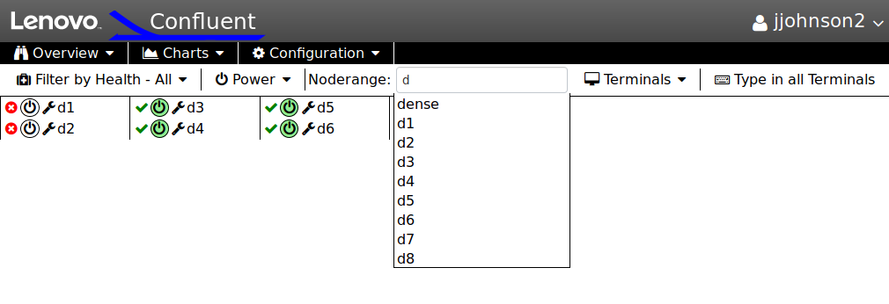

# 2.1.0 Confluent release

There is an update to the HPC software stack, bringing xCAT to 2.14.3.lenovo3, based on 2.14.3,
and confluent is brought to 2.1.0.
<!-- more -->

Here are some of the highlighted changes:

## Greatly improved collective recovery behavior

The collective functionality in 2.0 was unable to automatically continue running well under various
circumstances and would require manual intervention.  2.1 greatly improves this to automatically
recover more reliably and quickly.

## GUI now provides auto completion in the noderange field of the overview page

When typing into noderange, it will now offer completion options:

## nodeconfig can now provide access to advanced UEFI settings

`nodeconfig` has a new option, `-a` to work with advanced UEFI configuration settings.

## nodeconfig can now request restoring UEFI to factory default configuration

`nodeconfig` has a new option, `-r uefi` to reset the node to UEFI factory default settings

## nodeconfig and nodeattrib commands can now accept wildcard expressinos

Commands can now target attribute or settings using wildcards.  For example to use this to
configure all Mellanox ConnectX5 adapters as Ethernet:

    $ nodeconfig d3,d4 MellanoxNetworkAdapter-*.NetworkLinkType=Ethernet
    $ nodeconfig d3,d4 MellanoxNetworkAdapter-*.NetworkLinkType
    d3: MellanoxNetworkAdapter-0600.NetworkLinkType: Ethernet
    d3: MellanoxNetworkAdapter-0601.NetworkLinkType: Ethernet
    d4: MellanoxNetworkAdapter-0600.NetworkLinkType: Ethernet
    d4: MellanoxNetworkAdapter-0601.NetworkLinkType: Ethernet

## nodegroupattrib and nodeattrib can now prompt for attribute values interactively

This can be used to enter credentials interactively rather than passing them on command
line or via environment variable.  For example to globally declare a particular user and
password.

    $ nodegroupattrib everything -p bmcuser bmcpass
    Enter value for bmcuser: 
    Confirm value for bmcuser: 
    Enter value for bmcpass: 
    Confirm value for bmcpass: 
    everything: secret.hardwaremanagementpassword: ********
    everything: secret.hardwaremanagementuser: ********

## Discovery process can now apply relaxed password policy rules if desired

If the default policies on the XCC are not desireable, they may be customised as part of discovery.
For example to disable password expiration and the account lockout on too many incorrect attempts:

    $ nodegroupattrib everything discovery.passwordrules=expiration=no,loginfailures=no

## nodeinventory has had significant improvements

The structure of nodeinventory output has greatly improved for tracking multiple of the same
part in a system.  Additionally it will try to resolve genericly named adapters to more
descriptive names:

     # nodeinventory n771 |grep GPU
     n771: GV100GL [Tesla V100 PCIe 32GB] Type: GPU
     n771: GV100GL [Tesla V100 PCIe 32GB] 2 Type: GPU
     n771: GV100GL [Tesla V100 PCIe 32GB] 3 Type: GPU
     n771: GV100GL [Tesla V100 PCIe 32GB] 4 Type: GPU
     # nodeinventory d5 |grep Fabric
     d5: Omni-Path HFI Silicon 100 Series [discrete] Type: Fabric Controller

## Command line tab completion for confluent commands for bash users

Most confluent commands have been augmented with appropriate bash completion capability,
expanding suggested noderange completions as well as arguments following the noderange.

## collate can now create per-node output files

In addition to grouping data, collate can now organize node: data output into distinct files:

    $ nodeeventlog d1-d8 clear | collate -l {node}.log
    $ ls
    d1.log  d2.log  d3.log  d4.log  d5.log  d6.log  d7.log  d8.log

## Add interface for retrieving service data

See the [documentation]({{site.baseurl}}/documentation/man/nodesupport.html) for the `nodesupport` command.

## Improve consistency of the /networking/macs API

The /networking/macs API would clear during a rescan.  Now it presents the previous
data until the scan completes.

## The /networking/macs/rescan and /discovery/rescan APIs can now be read to show current scanning state

Developers wanting to track the completion of scan activities may now do so via the same resources that
are used to initiate rescans.

## Various bug fixes

For a complete list of changes, see our [git revisions](https://github.com/xcat2/confluent/compare/2.0.0...2.1.0 "Changes from 2.0.0 to 2.1.0")

