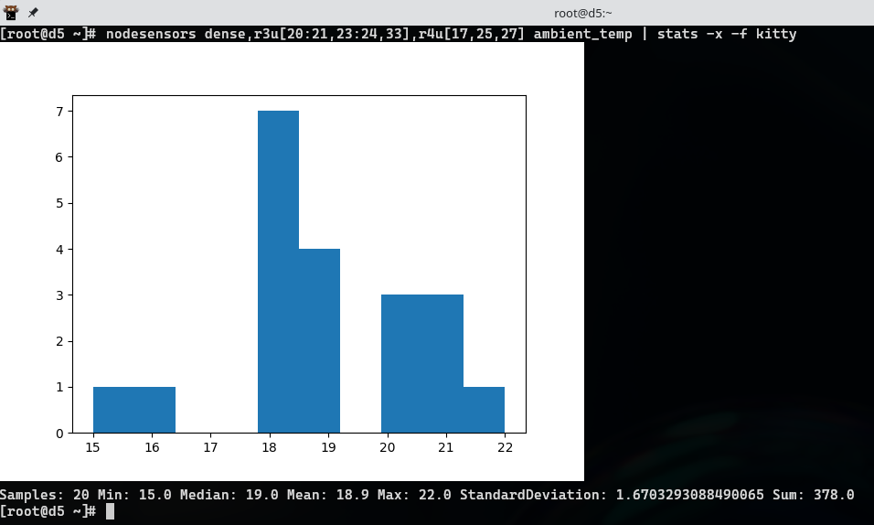

# 3.9.0 Confluent release

3.9.0 has been released with the following changes:
<!-- more -->

## Add cloning of Ubuntu

Ubuntu installations may now be cloned

## Add Ubuntu 22.04 diskless

Ubuntu 22.04 can now be diskless booted

## Add missing scripting support to Ubuntu scripted installation

Ubuntu scripted installation did not fully have pre.d, post.d, and firstboot.d.  Add
these hooks for more consistent Ubuntu behavior.

## Add netplan support to confignet

Confignet can now correctly configure netplan in Ubuntu installations

## Add openbmc console support

For OpenBMC based systems, a new console method 'openbmc' is provided
for better performance and security when working with such platforms.

## Break out partitioning and package list for EL scripted profiles

Make customization of EL profiles easier by having the partitioning and
package list as separate files for new profiles.

## `nodeattrib` can now read from a file

A nodeattrib batch file can now be specified by `nodeattrib -s`

## `nodersync` can now interact with a non-default interface

The `nodersync` command now has a `-s` switch consistent with `nodeping` and `nodeshell`.

## Fix cloning to NVME boot devices

The cloning would fail when the target was NVME, this is corrected.

## imgutil now has non-interactive operation

There is now a `-y` argument to imgutil to avoid being prompted by zypper or dnf

## Improved Cooltera CDU sensor behavior

A broader range of firmware is now supported.

## Improve imgutil capture warnings

Previously, a user would not be aware of missing parts of a clone until a test deployment.
Now a number of key dependencies are checked and fail the capture if it is known the image
would have challenges booting.

## Improved discovery performance and fixes.

Discovery activity for known nodes is reduced.  This particularly helps large systems with a collective.
Also, a problem where discovery could be terminated due to a bad subscription has been fixed.

## Improved collective behavior

Collective startup uses far less resources in large clusters.  Collective members now skip scanning switches that are
not relevant, per collective.managercandidates.  

## More graphical terminal support in `stats`

Stats can now specify a terminal format in '-f'.  The default remains sixel, but `iterm` and `kitty` are now implemented:

`kitty` is compatible with konsole, kitty, and wezterm and is the most recommended.  `iterm` may work in other terminals.
`sixel` is the slowest and most likely to have glitches, but may work with some terminals that support neither iterm nor kitty.

## Improve noderange collation in `collate`

Collate can now abbreviate numerical ranges and leverage bracket support to shorten the result.  For example:
`grp[1:2,4],t3u[18:25,30],t4u[20:30],t5u[17:24,27:30]`

## Mitigate poor DNS behavior

Slow DNS behavior has long caused issues in confluent. Confluent now enacts an aggressive timeout and makes some formerly
sequential name lookup activity concurrent.

## Confluent now has server side rack layout API call

API users now have a call that can more easily organize rack location information, `/noderange/[noderange]/layout`.

## Confluent 3.9.0 no longer has support for RHEL 7 as a management node

Confluent 3.9.0 will no longer support RHEL 7.x as a management node. Managing nodes running RHEL 7 is still supported. 
