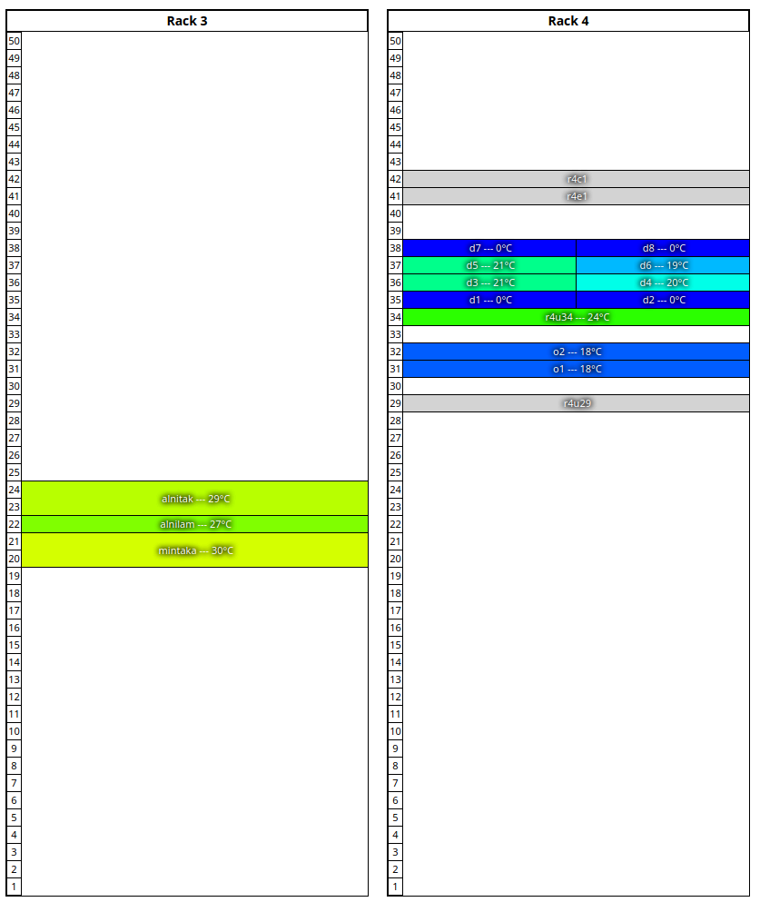

Confluent's web interface offers a rackview for rackmount and enclosure based systems. It can show where nodes are located in
racks and organize the racks into rows in the datacenter:

# Setting up a rackmount system

The three attributes relevant for a node are location.rack, location.u, and location.row. Ensure all three are set to a value. For multi-u systems, specify the lowest U. It is optional, though
recommended to also set location.height, as that will help the rackview draw more quickly than auto-detecting the component height.

Here is an example of how o2 was defined:

    # nodeattrib o2 location.rack location.u location.row location.height
    o2: location.height: 2
    o2: location.rack: 4
    o2: location.row: 1
    o2: location.u: 32

# Setting up an enclosure/dense system

The recommended attributes to set are for the enclosure to be specified according to the same instructions as a rackmount system above. The servers themselves
should not have any location information, as their location will be defined by enclosure.manager and enclosure.bay within the chassis definition.

Here is an example of a server (d1) inside an enclosure (smm1):

    # nodeattrib d1 enclosure.manager enclosure.bay
    d1: enclosure.bay: 1
    d1: enclosure.manager: smm1
    # nodeattrib smm1 location.rack location.u location.row location.height
    smm1: location.height: 2
    smm1: location.rack: 4
    smm1: location.row: 1
    smm1: location.u: 35

